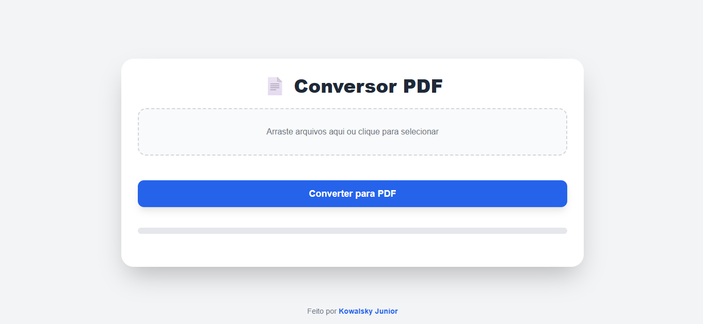

# 📄 Conversor de Arquivos para PDF

---

## 📌 Descrição do Projeto

O **Conversor de Arquivos para PDF** é uma aplicação web que permite transformar diversos tipos de arquivos em PDFs com facilidade, mantendo um **design elegante, responsivo e interativo**, ideal para profissionais e empresas que precisam de conversões rápidas e confiáveis.

**Funcionalidades avançadas:**

- Suporte a **Word (DOCX), Excel (XLSX), CSV, TXT e imagens (PNG, JPG, GIF, BMP, WebP)**  
- **Combinar múltiplos arquivos em um único PDF**  
- **Drag & Drop** e upload tradicional  
- **Lista interativa de arquivos**: miniaturas de imagens, ícones para outros arquivos, exclusão e reorganização por arrastar  
- **Barra de progresso animada** com feedback visual  
- **Mensagens de sucesso/erro**  

---

## ✨ Funcionalidades Detalhadas

- **🖱️ Drag & Drop:** Arraste arquivos diretamente para a área de upload  
- **📁 Upload tradicional:** Selecione arquivos via botão de upload  
- **🖼️ Miniaturas interativas:** Visualize imagens e ícones de outros arquivos  
- **❌ Excluir arquivos:** Remova arquivos individualmente antes da conversão  
- **🔄 Reorganizar arquivos:** Arraste arquivos para mudar a ordem antes de combinar PDFs  
- **📑 Combinar PDFs:** Opção de juntar todos os arquivos em um único PDF  
- **📊 Barra de progresso:** Visualiza o progresso da conversão em tempo real  
- **✅ Mensagem de sucesso/erro:** Feedback visual claro ao usuário  
                   
---

## 💻 Tecnologias Utilizadas

- **HTML5 & CSS3** – Estrutura e estilo responsivo  
- **JavaScript (ES6)** – Lógica de upload, conversão e interface  
- **[PDF-Lib](https://pdf-lib.js.org/)** – Manipulação e criação de PDFs  
- **[FileSaver.js](https://github.com/eligrey/FileSaver.js/)** – Download de PDFs  
- **[Mammoth.js](https://github.com/mwilliamson/mammoth.js)** – Leitura de arquivos Word  
- **[SheetJS (XLSX.js)](https://sheetjs.com/)** – Leitura de planilhas Excel  
- **TailwindCSS** – Design moderno e responsivo  

---

## ⚙️ Pré-requisitos

- Navegador moderno (Chrome, Edge, Firefox, Safari)  
- Conexão com internet para bibliotecas CDN ou arquivos locais  

---

## 📂 Estrutura do Projeto

```
pdf-formatter/
│
├── index.html # Página principal
├── /css
│ └── style.css # Estilos modernos e responsivos
├── /js
│ └── app.js # Lógica de upload, conversão e interface
└── /libs
├── pdf-lib.min.js # Biblioteca PDF-Lib
├── FileSaver.min.js # Biblioteca FileSaver.js
├── mammoth.browser.min.js # Biblioteca Mammoth.js
└── xlsx.full.min.js # Biblioteca SheetJS XLSX
```

---

## ⚡ Instalação

1. Clone o repositório:

```bash
git clone https://github.com/kowalskyjunior/pdf_converter.git
Abra o projeto em um editor de código (VSCode recomendado)

Abra index.html no navegador

🚀 Como Usar
Arraste arquivos ou clique na área de upload

Visualize os arquivos na lista, exclua ou reorganize se necessário

Marque “Combinar todos os arquivos em um único PDF” se desejar juntar os arquivos

Clique em “Converter para PDF”

A barra de progresso mostrará o status da conversão

O PDF será baixado automaticamente e a interface será limpa após 2 segundos

## 📸 Capturas de Tela

<p align="center">
  
</p>

🛠️ Créditos
Desenvolvido por Kowalsky Junior – GitHub

Bibliotecas open-source: PDF-Lib, FileSaver.js, Mammoth.js, SheetJS (XLSX.js)

📜 Licença
MIT License © Kowalsky Junior